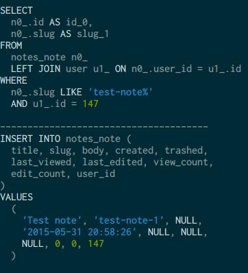

## MySQL query monitor

### About this tool
This is a very simple command line tool that enables you to watch MySQL queries
**in real time**. This is done by reading the MySQL general log. Queries are
nicely formatted and syntax-highlighted. Apart from this, this tool doesn't do
much (at least yet).

### Sample output

### Use cases
You may find it useful as a debug tool. A typical use case is to find out what
SQL queries are being issued by third-party software packages you're using.
For example, it could be useful to see what SQL queries your ORM is issueing.

### Requirements
* PHP >= 5.4
* Linux or Mac (this tool uses internally the `tail` utility);
* [composer](http://getcomposer.org/)

## Usage
    ./bin/mysql-query-monitor -f /path/to/your/mysql_general.log

To enable MySQL's general log:

    mysql> SET GLOBAL general_log = 'ON';
    mysql> SET GLOBAL general_log_file = '/var/lib/mysql/query.log';

Make sure that you have the permissions to read the MySQL log before running
this tool.

### To-dos
* Filter by process
* Filter by MySQL user
